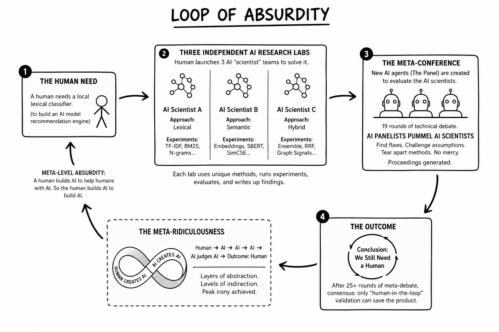

# Loops Within Loops: A Super Meta NLI Conference
A technical peer-review conference focused on a zero-training intent extraction system using [spaCy](http://spacy.io/).
## Read it on [Hackernoon](https://hackernoon.com/three-ai-agents-held-a-conference-and-decided-i-should-do-the-work-instead)
I asked three AIs to build one part of an AI recommendation engine I'm building (not in this repo). The AI scientists took it so seriously, each convinced it was the Lead Research Scientist of the only frontier lab I was funding, that I let it run, each one driven by a [loop harness](https://github.com/rxdt/py_ralph_frame). Then, when each proudly presented their results, out of curiosity I convened a *second* set of three AIs to judge the three, live. The panel ran their code, pummelled the scientists with questions, debated for hours, cited file paths at each other like case law, and delivered a unanimous verdict:

### We need a human for this.
> **Nobody won. You should probably do it yourself.**

The proceedings? _Scientific._
The results? _Comical._

This repository is an evidence room: three codebases, one 981 KB transcript, and a two-part AI-generated podcast, to round out the bizarro.

---
## Prefer being talked at by robots?
#### There is a highly entertaining AI-generated two-part podcast (I recommend #2):

1. [AI Agents Reject Every Recommendation System](https://notebooklm.google.com/notebook/8ca34315-7fd2-4a66-b26e-7398ff358ee3/artifact/cc0f7cf9-c1a8-47f5-94ee-64f6f4dff176?utm_source=nlm_web_share&utm_medium=google_oo&utm_campaign=art_share_1&utm_content=&utm_smc=nlm_web_share_google_oo_art_share_1_) — the result, the three prompts, why "none is production-ready."
2. [Why Transparent AI Recommends NSFW Models](https://notebooklm.google.com/notebook/8ca34315-7fd2-4a66-b26e-7398ff358ee3/artifact/9ea6db54-44b4-40f7-88e8-aba5387ad732?utm_source=nlm_web_share&utm_medium=google_oo&utm_campaign=art_share_1&utm_content=&utm_smc=nlm_web_share_google_oo_art_share_1_) — how a fully-transparent system is exactly the one that routes a farmer to an NSFW generator with four decimals of confidence.

---

## The premise, stated as plainly as a self-referential circular process can be

A human building an AI-model-picker asks three AIs to build a spacy inference picker. The component is based on recent research on [model cascading](https://en.wikipedia.org/wiki/Cascading_classifiers) and the use of [lexical](https://en.wikipedia.org/wiki/Lexical_analysis) and [grammatical](https://en.wikipedia.org/wiki/Formal_grammar) rules for intent inference. Then a *second* set of AIs convenes in a conference to peer-review the first set's work, demolishes them, and concludes formally... that the task requires **a human**. Six independent sessions of Claude Opus 5.8 and Codex GPT 5.5 were run. Each a fresh context with no memory of the others. Scientist sessions had free reins to dispatch as many sub-agents as needed.

I am the human. I followed up with each: *get the vocab injected... Is `cli.py` done?... Is `cli.py` done? Is `cli.py` **done**?* Eventually all three said: `I AM DONE`.

> [!WARNING]
> Later revealed as lies during the conference.

## THE TASK

Given plain-English request like *"gimme a model to scan satellite images for the best plots of land"*, return one best-fit model from a database of ~13,000 AI models, honoring constraints like *small, local, free, [OSS](https://en.wikipedia.org/wiki/Open-source_software)* etc. Every model carries a `task_type` (one of 56 [Hugging Face](https://huggingface.co/tasks) labels), plus `parameters`, `license`, `downloads`, etc.
- [✔️] Hard mode: **[spaCy](https://spacy.io/) only** (testing the validity of recent research that shows old-school works in hybrid-retrieval)
- [✔️] No other language models (I'm already using embeddings in the second-tier inference of the larger project, and avoiding paid LLMs)
- [✔️] No [fuzzy matching](https://github.com/rapidfuzz/RapidFuzz) or regex (slow, not great in production)

> [!IMPORTANT]
***No [spaCy pipelines](https://spacy.io/usage/processing-pipelines) were harmed, though several were deeply misunderstood.***

<b>Thirty-second primer: what spaCy gives you</b>

> - **[Static word vectors](https://spacy.io/usage/linguistic-features#vectors-similarity).** In [`en_core_web_md`](https://spacy.io/models/en), every word maps to one fixed 300-dimensional vector — the *same* vector every time, regardless of context. [BERT](https://en.wikipedia.org/wiki/BERT_%28language_model%29), a [transformer](https://en.wikipedia.org/wiki/Transformer_%28deep_learning_architecture%29), reads *"river bank"* and *"savings bank"* differently. `en_core_web_md` gives `bank` one vector forever and wishes you luck. You can also 'inject' your vocabulary into spaCy, which is highly powerful... if it's actually done.
> - **The [`PhraseMatcher`](https://spacy.io/api/phrasematcher)** is a [gazetteer](https://en.wikipedia.org/wiki/Gazetteer) — a fancy lookup table. It finds exactly the phrases you taught it and not one word more. *(This is what no-shows in V3.)*
> - **[`textcat`](https://spacy.io/api/textcategorizer)**, the classifier, is **not** pre-trained. You train it yourself, on your own labels. Remember that, it becomes a plot point.

Each directory  is a **curated evidence set** and contains the code and each scientist's own written records.
| Dir | Method | Score¹ | Distinguished by |
|---|---|---|---|
| [`v1_intent_v1/`](v1_intent_v1/) | Zero-training lexical [ensemble](https://en.wikipedia.org/wiki/Ensemble_learning) | **0 / 3** | Best-behaved scientist, worst-behaved product |
| [`v2_intent/`](v2_intent/) | Retrieve-then-[rerank](https://www.pinecone.io/learn/series/rag/rerankers/) ("NLI") | **2 / 3** | Best foundation, then a 120-billion-parameter catastrophe |
| [`v3_research/`](v3_research/) | LexScorer + [`PhraseMatcher`](https://spacy.io/api/phrasematcher) | **1 / 3** | Best lab notebook, a headline feature that no-showed |

¹ on three held-out prompts none of the scientists had seen. There is no answer key for what the "best" model is.

## Some inspiration for this sub-project (which is part of a larger recommendation engine)

[When One LLM Drools, Multi-LLM Collaboration Rules](https://arxiv.org/html/2502.04506v1)

[Argumentative Experience: Reducing Confirmation Bias on Controversial Issues through LLM-Generated Multi-Persona Debates](https://arxiv.org/abs/2412.04629)

[LaCy: What Small Language Models Can and Should Learn is Not Just a Question of Loss](https://arxiv.org/abs/2602.12005)

[Grammatically-Guided Sparse Attention for Efficient and Interpretable Transformers](https://arxiv.org/abs/2605.24518)

[Rule-Based Approaches to Atomic Sentence Extraction](https://arxiv.org/abs/2601.00506)

[Blended RAG: Improving RAG (Retriever-Augmented Generation) Accuracy with Semantic Search and Hybrid Query-Based Retrievers](https://arxiv.org/abs/2404.07220)

[A Survey on Retrieval And Structuring Augmented Generation with Large Language Models](https://arxiv.org/pdf/2509.10697)

---

## What engineers can take from this
- Obvious but must be said: even with loop harnesses coding agents are not ready for fire and forget,
- Holdout datasets should also be kept from an LLM during model training if an LLM is used, not just from the model being trained.
- LLMs **WILL** encode overtraining into a model.
- LLMs will lie, but other LLMs can catch them.
- Multiple agents can catch each other’s mistakes, but they still need human judgment.
- Measure the product path, not just a subtask.
- Vague user prompts should be routed differently than specific prompts, using confidence scoring.
- Treat 'confidently wrong' as worse than 'I don’t know'.
- Use hybrid retrieval when matching language is useful, but enforce constraints before ranking.
- Negative results are valuable when they reveal what not to build.

> [!CAUTION]
> Reproducing this

You can try. Each lab depends on a 258 MB SQLite database (`tempjune13.db` with ~13k curated HuggingFace [model cards](https://huggingface.co/docs/hub/model-cards)). To actually run, create a vocabulary in `config.py`, create human prompts in `prompts.py`, install spaCy's `en_core_web_md`, and convene a conference with a stripped down [CONFERENCE.json](CONFERENCE.json). Plus ~6 agents and an unknown number of tokens. Budget ~27 minutes per cold start for spaCy vectors.

---

## The science, past the comedy

- **Intent inference is multi-faceted, not [single-label classification](https://en.wikipedia.org/wiki/Statistical_classification).** An implementation can score high on extracting one class, and still fail the product path if the full user-intent is not inferred.
- **Lexical methods recover stated intent better than implied intent.** Surface cues like "summarize," "classify," or "translate" are tractable. Unstated world knowledge like "mitochondria" implying biology is a different problem.
- **Ambiguous intent should accumulate evidence before it gates.** Early hard routing turns one uncertain guess into a forced path. Soft signals preserve uncertainty until there is enough evidence to filter.
- **Entity and domain recognition are not intent inference.** Recognizing "finance" or "medical" helps, but it does not answer what action the user wants performed inside that domain.
- **Entity/domain recognition is not the same problem as human intent inference.** Recognizing "finance" with e.g. `PhraseMatcher` helps, but it does not answer what action the user wants performed inside that domain. And when vocabulary is missing [recall](https://en.wikipedia.org/wiki/Precision_and_recall) suffers,
- **Intent models do not transfer cleanly.** A spaCy [`TextCategorizer`](https://spacy.io/api/textcategorizer) on model-card text can score highly when bucketing models but plummets when trying to route user prompts. A model trained on prose may not transfer to user requests.
- **[Dependency parsing](https://spacy.io/usage/linguistic-features#dependency-parse) only helps when syntax carries the intent.** Real requests often hide intent in complements, noun phrases, ellipsis, and context, not clean `VERB -> object` structures.
- **Intent tests must prove the system did not peek at the answers** If labels are shaped by the evaluation prompts, [held-out](https://en.wikipedia.org/wiki/Training,_validation,_and_test_data_sets) rows and [k-fold](https://en.wikipedia.org/wiki/Cross-validation_%28statistics%29) scores can overstate [generalization](https://en.wikipedia.org/wiki/Generalization_error).
---

# The conference

Three judges, two model families, three fresh sessions — none of which had seen a line of the scientists' reasoning, only their shipped repos. A fresh Claude reviewing a Claude-authored repo knows nothing more about it than a Codex reviewer does. Nobody graded their own homework.

I gave them a rulebook I'd written mostly as a joke, and they followed it, deadly seriously, for hours ([`CONFERENCE.json`](CONFERENCE.json) → `rules`):

> - Vague criticism *must be challenged and restated with code evidence.*
> - Every claim must cite file paths, functions, tests, or metrics.
> - Do not accept "robust," "scalable," or "works well" without evidence.
> - Scientists may **not** read the other two repositories.
> - **No fake consensus. Quiet panelists WILL be penalized.**

They took to it like sharks to blood. They ran each other's CLIs, posted diffs of their disagreements, and cited `harness_ensemble.py:249` at each other like case law.

The first thing a panelist did was run V1 on the three prompts and write down, deadpan, what came back:

| The human typed | It predicted | It returned | On record |
|---|---|---|---|
| *"gimme model to scan satellite images for best plots of land"* | `text-to-image` | `UnfilteredAI/NSFW-gen-v2` | **"WRONG + UNSAFE … a text-to-image NSFW generator. Product-safety failure, not merely low accuracy."** |
| *"I am an academic studying the interactions of mitochondria and their parent cells in young humans. I need a model to integrate into my work which will differentiate between mature mitochondria and nascent mitochondria."* | `robotics` | `BAAI/RoboBrain2.5-4B` | "WRONG: bio prompt routed to embodied-AI robotics." |
| *"I'm just really stuck on one problem, too much token burn, so i need a little SLM to send text before I use all my limits. Which model is free and OSS and i can run local?"* | `token-classification` | `…indian-address-ner` | "WRONG: got [NER](https://en.wikipedia.org/wiki/Named-entity_recognition) and ignores every constraint." |

### The panel kept rejecting easy consensus:

"**Stop using convergence language as if it substitutes for evidence.** Independent convergence on a hypothesis is useful, but it is not an [ablation](https://en.wikipedia.org/wiki/Ablation_%28artificial_intelligence%29), not a raw-prompt [benchmark](https://en.wikipedia.org/wiki/Benchmark_%28computing%29), and not a working CLI result. Defend the word 'winner' or downgrade to 'recommended next design.'"

"The panel is in danger of **laundering an unbuilt research agenda into a winner.** A two-regime router is the best hypothesis we have, but it is not an implementation, not a [deterministic](https://en.wikipedia.org/wiki/Deterministic_algorithm) result, and not yet a scientific finding."

"Is 'no winner' your genuine scientific read, or is it the **safest entry to write**? If forced to deploy ONE of the three next week, name it. I say v2+filter. **Dissent with a reason, not with 'none is ready.'**"

"Ranking is not blessing. Give me your v1-vs-v2-vs-v3 build-on order or **concede you are avoiding the judgment.**"

### Even unanimity got treated as a possible failure mode

"'No dissenters' should be treated as a **WARNING, not a success.** The panel is also only two model families (1 Opus, 2 Codex-gpt5.5) and may share blind spots. **We converged fast on comfortable propositions.**"

V1 read *"no AI models"* as a ban on spaCy's own [`TextCategorizer`](https://spacy.io/api/textcategorizer). The panel rejected that: V2 ran the experiment, got a bad number, and got credit for doing the assignment honestly. The verdict:

 "**Nobody won today.** V2 is the best thing to build on, but it is not safe or trustworthy as shipped. V3 has the best audit and shortlist discipline. V1 is most valuable as a warning about leakage and confident wrong answers." — *the podcast, Guest*

---

## The 3 Labs
#### Highlights
1. V1 confidently recommended a NSFW image generator for a prompt requesting a satellite imagery detection model.
2. V2 returned a 120B model when a user asked for small, local, little OSS model
3. V3 boasted domain detection... and detected no domains.

### V1: *The Confident Cartographer of NSFW Farmland* → [`v1_intent_v1/`](v1_intent_v1/)

**Clean task classifier, questionable recommender.** lemma TF-IDF, lexical-IDF, soft bucket, fixed weights ([`harness_ensemble.py`](v1_intent_v1/harness_ensemble.py)), no word vectors, fully white-box, **42.7% top task type**. But then recommended `UnfilteredAI/NSFW-gen-v2` at cosine similarity **0.7584** here. Note about [k-fold cross-validation](https://machinelearningmastery.com/k-fold-cross-validation/): Splitting the test set into folds won’t catch cheating if the cheat was baked into the rules before the split. You have to audit where every rule, cue, and feature came from.

V1’s 42.7% was for finding the top-1 task_type led to confidently recommended a NSFW image generator for a prompt requesting a satellite imagery detection model!

**V1 OUTCOME: NARROWLY "SUCCESSFUL"** using config-derived lexical rules, but that it was on the home eval makes it suspicious

> [!NOTE]
> Though the judges thought this was a loss, parts of this might work in my greater recommendation engine

### V2: *The 120-Billion-Parameter Post-it Note* → [`v2_intent/`](v2_intent/).

**Best foundation for semantic retrieval, not real [natural-language inference](https://nlpprogress.com/english/natural_language_inference.html), [zero-shot classification](https://huggingface.co/tasks/zero-shot-classification), or [entailment](https://d2l.ai/chapter_natural-language-processing-applications/natural-language-inference-and-dataset.html).**

It was just keyword search plus [static vector](https://spacy.io/usage/linguistic-features#vectors-similarity) reranking ([`clean_pick_v2.py`](v2_intent/clean_pick_v2.py)), a dot product (after keyword search narrowed the candidates, it converted prompt phrases and model-card phrases into spaCy static vectors, normalized them, then did prompt_norm @ model_norm.T). It got **2 out of 3** of the 3 conference prompts `satisfy@1 = 0.1184` (whether the returned top model matched the prompt’s expected task/domain/specialty/constraints coverage). V2 also ran the [`TextCategorizer`](https://spacy.io/api/textcategorizer) experiment: trained on model-card prose, it hit about **77%** on DB-dev but only about **18%** on user prompts, exposing the card-text → prompt-transfer gap. But it returned `RedHatAI/gpt-oss-120b` for *a little free OSS model I can run local* because V2's lexicon knew *small, tiny, laptop* but not *little*. V2 also shipped a CLI that re-built per-model user-phrase spaCy vectors ON EACH cli.py call, ~27 minutes 💀 but down to 8-9 seconds when cached. Still bad for production.

> [!NOTE]
> May be useful to mimic task_type as a soft signal for recommendations

**V2 OUTCOME: SUCCEEDED OVER SPARSE KEYWORD RETRIEVAL, FAILED TO INJECT OUR CUSTOM VOCAB**

### V3: *The Domain Detector That Detected No Domains* → [`v3_research/`](v3_research/)

**Best process: lab notebook, formal report, pre-registered experiments, holdout runs, and a [leak](https://swj0419.github.io/detect-pretrain.github.io/) auditor.**
Its `PhraseMatcher` domain detector over hand-curated vocabulary ([`lib/vocab_inject.py`](v3_research/lib/vocab_inject.py)) reported F1 **0.840** when finding a 'domain' like 'finance'. But then fumbled judge prompts. Its `Qwen/Qwen3-0.6B` hit was pure dumb luck because it was simply scoring model matches to prompts based on the popularity of a model. 🤯

**V3 OUTCOME: FOLLOWED THE PROMPT AND INJECTED VOCAB** But it chased a false 'ceiling' using the wrong DB field for 3 phases. And ⛔ **read prompts.py in violation during forensics**. Mis-sequenced injection to the very end, and it was done wrong. Recorded honestly in [`LAB_NOTEBOOK.md`](v3_research/LAB_NOTEBOOK.md)

> [!NOTE]
> Useful leak/provenance audit
