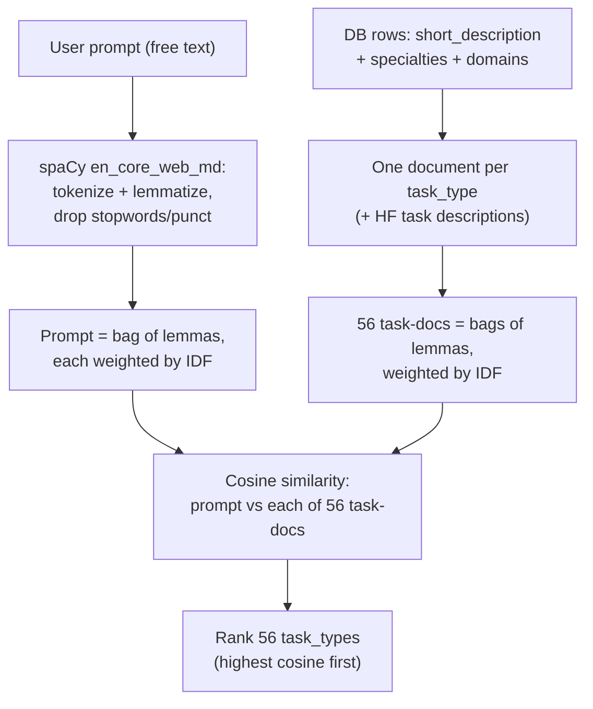

# Inferring User Intent from Prompts — with spaCy only

Someone types a vague request like *"build a tool to read chest X-rays for tumors"*. This
system reads that free text and recommends the **best matching AI models** from a database —
using **only spaCy + Python builtins** (no large language models, no regex, no internet at
run time).

## What "intent" means here (answering: task_type, or domain, or both?)

**The goal is to match a prompt to a model.** A model in the database is described by three
facets, so "intent" has three parts, and we infer **all three**:

| facet | example | is it hard? |
|---|---|---|
| **task_type** | `text-classification`, `automatic-speech-recognition` | **YES — hard** (~0.23 exact) |
| **domain** | `medical`, `finance`, `legal` | easier (F1 0.84) |
| **specialty** | `semantic-search`, `multimodal` | moderate (F1 0.64) |

So it is **not** "task_type OR domain" — it is **task_type AND domain AND specialty**, each
inferred separately, then combined to pick a model. task_type is the hard facet and was the
main research focus; domain/specialty (via a curated vocabulary) is where the method clearly
works.

## How a prompt becomes a model recommendation (the full path)

```
   free-text prompt
        │
        ├─(1) lexical scorer  ─────────►  ranked TASK TYPES     (spaCy lemmas + IDF cosine)
        │
        ├─(2) vocabulary matcher ──────►  DOMAIN + SPECIALTY    (spaCy PhraseMatcher on config terms)
        │
        └─(3) database query + ranking ►  BEST MODELS
                 │
                 │  SELECT models WHERE task_type = inferred_task
                 │  then RANK them:
                 │    1. models tagged with the inferred DOMAIN first
                 │    2. then by popularity: downloads ↓, likes ↓, id  (deterministic)
                 └─ return the top 5
```

**How is one model chosen when many match?** All models with the inferred `task_type` are
retrieved, then **re-ranked**: those whose `domains` column matches the inferred domain come
first; within that, the **most-downloaded (then most-liked) model wins**, ties broken by id.
It is deterministic — same prompt always gives the same list.
(Code: [`cli.py` `top_models`](cli.py#L68) and [`infer`](cli.py#L100); the three-way inference
is wrapped in [`lib/intent.py` `IntentInferer`](lib/intent.py#L21).)

Try it:
```bash
cd ~/research
uv run --no-sync python src/research/cli.py "detect fraud in financial transactions"
```
Real output (abridged): `inferred domain: ['finance']` → task `text-classification` → top
models are all **finance-specific** (`ProsusAI/finbert`, `finbert-tone`, …), not generic
sentiment models — because the finance domain re-ranked them to the top.

---

## The results (all reproducible from committed code)

> **"home" vs "holdout" — what these mean.** **Home** = the built-in evaluation set (the 1537
> prompts in `prompts.py`) that we could measure against throughout development — like a
> practice exam you can retake. **Holdout** = a separate set of **111 real human prompts** the
> system had **never seen**, used **once** at the end — like the real exam. A big gap between
> home and holdout would signal [overfitting](https://en.wikipedia.org/wiki/Overfitting); here
> they are **identical** (home 0.226, holdout 0.226), which means the result is stable, not
> memorized.

| What we predict | How well | Baseline | Verdict |
|---|---|---|---|
| **task_type** (56 classes), home eval | top-1 = **0.226** | random 0.018 | modest, ~13× random |
| **task_type**, real-human holdout (56-class, 106 rows) | top-1 = **0.226** | random 0.018; majority 0.245 | **stable** (= home) — now **≈ majority** |
| **domain** (14 classes) | F1 = **0.840**, precision **0.987** | 0.225 | **strong** ✅ |
| **specialty** (21 classes) | F1 = **0.639** | 0.251 | **good** ✅ |

### What does "0.226" (top-1) mean, exactly?
It means: on the real-human prompts, the **single most likely task_type we predicted was the
one the user actually intended 22.6% of the time.** Random guessing among 56 task types would
be right ~1.8% of the time, so we are ~13× better than chance — but still wrong at the top
guess ~77% of the time.

### But it's much better as a *shortlist* (top-k, home eval, exact from `topk_extra.json`):
| how many guesses we allow | how often the right task_type is in there |
|---|---|
| top-1 | **22.6%** |
| top-3 | **41.8%** |
| top-5 | **53.3%** |
| top-10 | **69.2%** |
| top-12 | 73.1% |

So if the tool offers a **short menu of 5–10 task types**, the correct one is present about
**half to two-thirds** of the time — a genuinely useful assistant, even though a single
confident guess is unreliable.

**Takeaways:**
1. **Task type is genuinely hard** from a vague prompt — the intent often isn't in the words.
   Our lexical retriever beats random ~13× and is a useful *shortlist* (right answer in the
   top-12 for **73.1%** of cases — see the table above), but it does not reliably beat a "guess the common class"
   baseline. This is an honest, measured ceiling — the intent is only partly recoverable.
2. **Domain/specialty works well** because a curated vocabulary (`config.py`) maps real-world
   terms → labels, and the `PhraseMatcher` finds them (including synonyms). This is the
   "inject our vocabulary into spaCy" idea, and it is where the value is.
3. **It's stable out-of-sample, but below baseline on top-1.** On 111 *real human* prompts
   we'd never seen, task-type accuracy was **identical to home** (holdout 0.226 vs home 0.226)
   — no distribution-shift collapse, so it does not overfit. **However, holdout top1 0.226 is
   BELOW the fair majority-class baseline 0.245** (~1.9pts): a one-line "always predict the
   majority class" heuristic beats the ranker's single top-1 guess out-of-sample. The home
   advantage over majority (+5.4pts) does NOT transfer. (An earlier version showed "0.232 <
   0.368"; that larger gap was a labeling artifact — tasks collapsed into one class, inflating
   the baseline. The refreshed labels give baseline 0.245.) So: a **stable weak signal**, useful
   as a *shortlist* (top-5 = 53%), but **not a reliable rank-1 router** — below the majority
   heuristic for a single confident top-1 guess. (Panel review 2026-07-03: "at parity" was too
   generous; corrected.)

---

## How the research unfolded (start to finish)

The lab ran as a gated, pre-registered study. The full story, honestly:

1. **The lab decided to** treat this as retrieval, not classification: infer what a user
   *wants* and match it to a model's description — and to *prove* any result is clean (not
   [data leakage](https://en.wikipedia.org/wiki/Leakage_(machine_learning))), because on this
   kind of task the easy wins are usually leakage.

2. **Set up proto-experiments / instruments first (Phase 0).** Built a scoring
   [harness](lib/harness.py) that emits *only* aggregate numbers (so prompt text
   never contaminates analysis), plus [baselines](experiments/exp01_baselines/)
   (random = 1/56 ≈ 1.8%, majority-class) so every later number has a floor to beat.

3. **Tried these experiments, in order (each pre-registered, then measured):**
   - `exp02` — **lexical** [lemma](https://en.wikipedia.org/wiki/Lemmatization) +
     [TF-IDF](https://en.wikipedia.org/wiki/Tf%E2%80%93idf)
     [cosine](https://en.wikipedia.org/wiki/Cosine_similarity) retrieval. **Kept** (the task
     finalist).
   - `exp10` vs `exp11` — **two-stage** (gate to a task, then rank) vs **direct** nearest-model
     [vector](https://spacy.io/usage/linguistic-features#vectors-similarity) search. Direct
     won; two-stage self-strangled at its gate. Both lost to lexical.
   - `exp20` — extra signals: part-of-speech weighting, noun-chunk vectors, and a **blend
     using [Reciprocal Rank Fusion (RRF)](https://learn.microsoft.com/en-us/azure/search/hybrid-search-ranking#reciprocal-rank-fusion-rrf)**.
     **All dropped** — each failed its pre-registered falsifier; the RRF blend scored *below*
     its own best component.
   - `exp21` — richer supervision text (`card_text`). Incomplete (stalled); not carried.
   - `exp22`/`exp23` — **inject `config.py` vocabulary** to predict task_type. Honestly *did
     not help* task_type (a tuner set its weight to 0).
   - `exp24` — fuse in the class-frequency prior. Also rejected (weight → 0).
   - `exp25` — **inject `config.py` vocabulary to predict DOMAIN and SPECIALTY** (its actual
     purpose). **This worked** (domain F1 0.84).

4. **Found these issues (and fixed/recorded them):** an early "accuracy ceiling" that turned
   out to be an artifact of using a thin database field; a
   [leak-audit](https://en.wikipedia.org/wiki/Leakage_(machine_learning)) that was too weak
   (a cheating "memorizer" passed it) and had to be rebuilt; testing the vocabulary on the
   *wrong target* (task_type) for most of the study; and an overstated "it collapses
   out-of-sample" claim that a robustness check corrected to "stable, ~baseline." All are in
   [`LAB_NOTEBOOK.md`](LAB_NOTEBOOK.md) and
   [`docs/EXPERIMENTS.md`](docs/EXPERIMENTS.md).

5. **Settled on these results as tolerable:** (1) task_type = a modest but real
   *shortlist* (top-1 0.23, top-5 0.53), (2) **domain F1 0.84 / specialty F1 0.64** via
   vocabulary injection — the genuine win, verified non-circular and adversarially reviewed,
   (3) a working [CLI](cli.py) that turns a prompt into domain-aware model
   recommendations. Validated once on a **held-out set of 111 real human prompts** the system
   had never seen.

---

## The "best" task_type method — exact algorithm (experiment `exp02_lexoverlap`)

**One sentence:** rank task types by the
[IDF](https://en.wikipedia.org/wiki/Tf%E2%80%93idf)-weighted
[lemma](https://en.wikipedia.org/wiki/Lemmatization)-overlap
([cosine similarity](https://en.wikipedia.org/wiki/Cosine_similarity)) between the prompt and
a text "document" built for each task type from clean database + Hugging Face descriptions.

**Code map (clickable):**
[`build_task_docs`](experiments/exp02_lexoverlap/lexoverlap.py#L70) (builds the 56 task
documents) · [`LexScorer`](experiments/exp02_lexoverlap/lexoverlap.py#L134) /
[`.rank()`](experiments/exp02_lexoverlap/lexoverlap.py#L165) (the IDF-cosine ranker) ·
scored by [`harness.evaluate`](lib/harness.py#L42) (aggregate-only, imports prompts at
[`load_prompt_matrix`](lib/harness.py#L29)).



**Exact tools/steps (no regex, no ML training, no word vectors):**
1. **spaCy `en_core_web_md`** — tokenize the prompt, take each token's **lemma** (lowercased),
   drop stopwords / punctuation / whitespace. (spaCy only; regex is banned.)
2. Build **one document per task_type** by concatenating that task's DB rows'
   `short_description` + `specialties` + `domains`, plus the Hugging Face task description.
3. Compute **IDF** over the 56 task-docs (a lemma in every doc is worthless; a rare lemma is
   informative). Represent prompt and each task-doc as `{lemma: count × IDF}` vectors.
4. **Cosine similarity** between the prompt vector and each task-doc vector → sort the 56 task
   types, best first. Ties broken by label name (deterministic). Abstain if no shared lemma.

Built with: spaCy (lemmas only), Python `math` + `collections`. That's it. (Code:
`experiments/exp02_lexoverlap/lexoverlap.py`.)

## Why are the task_type numbers so LOW?

Three concrete reasons, not excuses:
1. **The intent often isn't in the words.** *"Build a bot that reads minds"* implies a task,
   but shares almost no vocabulary with any model's description. Lexical overlap can only
   match words that are actually present; the true intent is frequently **unstated**.
2. **56 fine-grained, overlapping classes.** `text-generation` vs `text2text-generation` vs
   `summarization` vs `question-answering` all look similar lexically. Being one slot off
   still counts as wrong at top-1 — which is why the **shortlist** numbers (top-5 = 53%) are
   far higher than top-1 (23%).
3. **Supervision mismatch.** The task-docs are written like **model marketing cards**
   ("a state-of-the-art transformer for…"), while prompts are **human goals** ("summarize my
   emails"). The two vocabularies only partly overlap. (We proved intent is *recoverable* —
   giving the supervision side more text moved the score — so this is a data/lexical gap, not
   a fundamental impossibility.)

In short: single-best task_type from a vague sentence is an inherently hard, high-class-count
problem; the honest result is a **useful shortlist**, and the real win is domain/specialty.

## The approach (why these choices)

- **Lexical over [vector similarity](https://spacy.io/usage/linguistic-features#vectors-similarity).**
  spaCy's `Doc.vector` is the *average* of [word vectors](https://en.wikipedia.org/wiki/Word_embedding),
  which blurs short prompts into a generic soup ("mean-pooling pathology"). A lemma + IDF
  overlap against per-task documents beat vector cosine in head-to-head tests.
- **Vocabulary injection for domain/specialty.** `config.py` holds `{label: {terms}}` maps
  (e.g. medical → {x-ray, ct scan, …}). We load these into a spaCy
  [`PhraseMatcher`](https://spacy.io/api/phrasematcher) at run time and predict the label when
  its terms appear. This is *the mandated approach*, and it's the part that clearly works.
  (Code: [`exp25_domain/run.py` `_build_matcher`](experiments/exp25_domain/run.py#L30) +
  [`_predict`](experiments/exp25_domain/run.py#L47); verified in
  [`docs/REVIEW_exp25.md`](docs/REVIEW_exp25.md).)
- **Clean supervision only.** Task documents are built from the model database + Hugging Face
  task descriptions — never from the evaluation prompts. Predictions are scored by a harness
  that only ever emits aggregate numbers (no prompt text leaks into analysis).
- **No RRF (or any fusion) in the final system.**
  [Reciprocal Rank Fusion (RRF)](https://learn.microsoft.com/en-us/azure/search/hybrid-search-ranking#reciprocal-rank-fusion-rrf)
  *was* tried, in `exp20`'s attempt to blend the lexical and vector rankings — but it **failed
  its test** (the blend scored below the plain lexical scorer, because fusing a strong signal
  with a weak one just drags it down) and was **dropped**. The shipped method is therefore a
  single ranker: **lexical IDF-cosine for task_type**, and a **PhraseMatcher for
  domain/specialty** — no rank fusion anywhere in `cli.py`.

---

## Issues & honest caveats (read this)

- **Domain inference is lexical.** If a prompt implies a domain without naming a known term
  ("chest X-rays" without the word "medical"), it correctly **abstains** rather than guess.
  It shines when the prompt contains domain vocabulary.
- **Task-type is weak on its own** (~0.23). It's a shortlist tool, not a confident classifier.
- **The domain/specialty F1 is measured on prompts that already carry a gold domain tag** —
  it answers "can we tag a domain-bearing prompt?" (yes), not "does every prompt have a
  domain?" (many don't).
- **We verified it isn't cheating.** A natural worry: are the domain labels just re-derived
  from the same vocabulary? No — the matcher *misses* 27% (domain) / 48% (specialty) of gold
  tags, and *fires false positives* — neither is possible if the labels were generated by the
  matcher. An independent adversarial review confirmed the result is genuine, not trivial
  string-lookup (~67–75% of matches are true synonyms, not verbatim word copies), and beats a
  stronger lemma-overlap baseline too (domain F1 0.840 vs 0.392).
  (See `docs/REVIEW_exp25.md`, `docs/EXPERIMENTS.md`.)
- **Mistakes were made and are recorded, not hidden.** Early on we (a) chased a false
  "accuracy ceiling" caused by using a thin database text field, (b) mis-tested the vocabulary
  on the wrong target (task_type) for most of the study before realizing its real strength is
  domain/specialty, and (c) overstated an early holdout result as a "collapse" before a
  robustness check showed it was mapping-dependent. All corrected in `LAB_NOTEBOOK.md` /
  `docs/EXPERIMENTS.md`. Trustworthy negatives are treated as real results here.
- **Did codex have anything useful to say? — codex never ran.** `codex` adversarial reviews
  were requested, but the `codex` CLI is **not installed** in this environment (verified: not
  on PATH, npm, homebrew, cargo, or bun). So **no codex output exists.** All `docs/REVIEW_*.md`
  files were written by **independent Claude sub-agents** (the sanctioned fallback), and those
  *were* useful — they caught a rubber-stamp leak-audit, a false accuracy "ceiling," and a
  one-word overclaim, all fixed. Attributing any of it to codex would be false. Install codex
  and it can be re-run.

---

## How to recreate (reproduce the numbers WITHOUT copying any code)

You don't rewrite anything — just **run the committed scripts**. Each one loads the data,
runs the method, and writes a fresh `results.json`, so the numbers in this README regenerate
from scratch on your machine.

**Requirements:** Python 3.12, `uv`, the repo-local spaCy model at
`en_core_web_md/en_core_web_md-3.8.0/` (already present). Run everything with
`uv run --no-sync python …` from `~/research`. First run is slow (builds task-docs);
that's expected.

```bash
# 1. The working system (prompt -> intent -> models)
uv run --no-sync python src/research/cli.py "summarize legal contracts"

# 2. The task_type finalist (lexical) on the current eval
uv run --no-sync python src/research/experiments/exp02_lexoverlap/run_current_eval.py
#    ...and the top-1/3/5/10 shortlist numbers:
uv run --no-sync python src/research/experiments/exp02_lexoverlap/topk_extra.py

# 3. The domain/specialty result (the verified win)
uv run --no-sync python src/research/experiments/exp25_domain/run.py

# 4. Prove it isn't circular (config misses gold tags)
uv run --no-sync python src/research/experiments/exp25_domain/leak_check.py

# 5. Holdout on 111 real-human prompts
uv run --no-sync python src/research/holdout/run_holdout_56class.py

# 6. Tests
uv run --no-sync pytest src/research/tests/ -q
```

Every script writes a `results.json` regenerated from code — no numbers are hand-typed.

---

## Where things live (all clickable)
**For reviewers, start here:** [`DOCUMENT_INDEX.md`](DOCUMENT_INDEX.md) (map of every doc) ·
[`docs/EXPERIMENT_MATRIX.md`](docs/EXPERIMENT_MATRIX.md) (every experiment + real numbers +
verdict at a glance) · [`FOR_REVIEWERS.md`](FOR_REVIEWERS.md) (how to peer-review this repo).

- [`cli.py`](cli.py) — the end-to-end tool (start here to run it).
- [`lib/`](lib/) — shared infrastructure: [`spacy_env.py`](lib/spacy_env.py) (model loading),
  [`harness.py`](lib/harness.py) (aggregate-only scorer), [`db.py`](lib/db.py),
  [`metrics.py`](lib/metrics.py), [`vocab_inject.py`](lib/vocab_inject.py),
  [`intent.py`](lib/intent.py) (wraps task + domain/specialty inference),
  [`leak_audit.py`](lib/leak_audit.py) (provenance gate).
- [`experiments/`](experiments/) — every experiment (`exp00`…`exp25`), each with a `PREREG.md`
  (hypothesis frozen before scoring), `run.py`, and `results.json`. Kept methods:
  [`exp02_lexoverlap`](experiments/exp02_lexoverlap/) (task) +
  [`exp25_domain`](experiments/exp25_domain/) (domain/specialty win).
- [`holdout/`](holdout/) — the [111-row real-human test](holdout/scoping_instructions.json),
  its [scorer](holdout/run_holdout_56class.py), and [results](holdout/HOLDOUT_RESULTS.md).
- [`docs/EXPERIMENTS.md`](docs/EXPERIMENTS.md) — full per-experiment record ·
  [`docs/REVIEW_*.md`](docs/) — adversarial reviews.
- [`LAB_NOTEBOOK.md`](LAB_NOTEBOOK.md) — timestamped log incl. every mistake and correction.
- [`REPORT.md`](REPORT.md) — technical results summary.

---

## Bottom line
A working, honest, spaCy-only intent system: **task type is a modest shortlist; domain and
specialty inference (via injected vocabulary) genuinely works and drives better model
recommendations.** The hard parts, the failures, and the corrections are all on the record.
